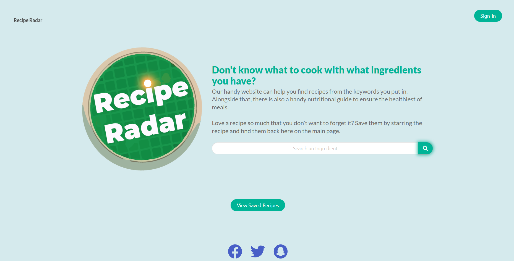

# Group #3 _ project-1 - Recipe Radar

## Description
Recipe Radar is a web application that helps users find recipes based on the ingredients they have. It also provides nutritional information and allows users to save their favorite recipes for easy access in the future.

## Features
- **Ingredient-based Recipe Search:** Enter the ingredients you have on hand, and Recipe Radar will provide a list of recipes that use those ingredients. This feature helps you make the most of what you have in your pantry.
- **Nutritional Information:** Each recipe comes with detailed nutritional information, helping you make informed choices about what you eat.
- **Save Favorite Recipes:** Found a recipe you love? Save it for easy access later. Your favorite recipes are just a click away.
- **Mobile Responsive Design:** Whether you're on a desktop, tablet, or mobile device, Recipe Radar provides a seamless experience.

## Getting Started
These instructions will get you a copy of the project up and running on your local machine for development and testing purposes.

### Prerequisites
- A modern web browser (Google Chrome, Firefox, Safari, etc.)

### Installation
1. Clone the repository to your local machine using `git@github.com:jujusoi/Project-1.git`
2. Navigate to the project directory in your terminal.
3. Open the `index.html` file in your web browser.

## Usage
1. Enter the ingredients you have in the search bar.
2. Click the "Search" button.
3. The application will display a list of recipes that use those ingredients.
4. Click on a recipe to view more details, including nutritional information.
5. Click the "Save" button to save a recipe to your favorites.

## Credits

API used, 

Edamam API https://developer.edamam.com/edamam-recipe-api

Firebase API  https://firebase.google.com/

jQuery api used, https://api.jquery.com/

CSS framework used, https://bulma.io/

## License

MIT License

Permission is hereby granted, free of charge, to any person obtaining a copy
of this software and associated documentation files (the "Software"), to deal
in the Software without restriction, including without limitation the rights
to use, copy, modify, merge, publish, distribute, sublicense, and/or sell
copies of the Software, and to permit persons to whom the Software is
furnished to do so, subject to the following conditions:

The above copyright notice and this permission notice shall be included in all
copies or substantial portions of the Software.

THE SOFTWARE IS PROVIDED "AS IS", WITHOUT WARRANTY OF ANY KIND, EXPRESS OR
IMPLIED, INCLUDING BUT NOT LIMITED TO THE WARRANTIES OF MERCHANTABILITY,
FITNESS FOR A PARTICULAR PURPOSE AND NONINFRINGEMENT. IN NO EVENT SHALL THE
AUTHORS OR COPYRIGHT HOLDERS BE LIABLE FOR ANY CLAIM, DAMAGES OR OTHER
LIABILITY, WHETHER IN AN ACTION OF CONTRACT, TORT OR OTHERWISE, ARISING FROM,
OUT OF OR IN CONNECTION WITH THE SOFTWARE OR THE USE OR OTHER DEALINGS IN THE
SOFTWARE.